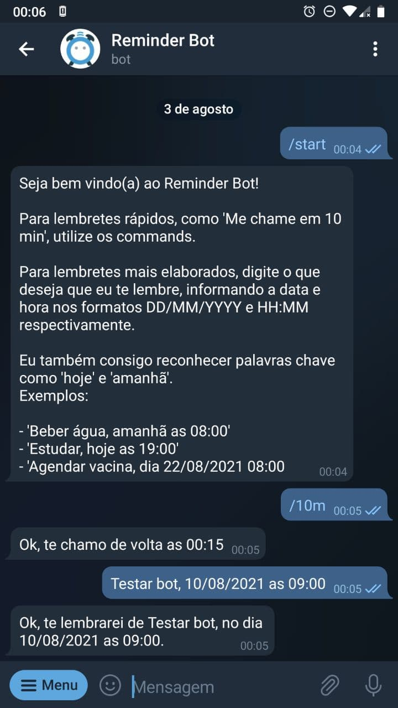

# telegram-reminder-bot-python

Meu bot de lembretes do telegram. Você pode utilizá-lo clicando 
[aqui](https://t.me/doc_reminder_bot).

## Features

- Lembretes rápidos de `10min`, `30min`, `1h` e `1d` através dos **commands**
- Lembretes personalizados, criados a partir de uma mensagem enviada para o bot
  - Termos como `hoje` e `amanhã` são reconhecidos

## Screenshots

